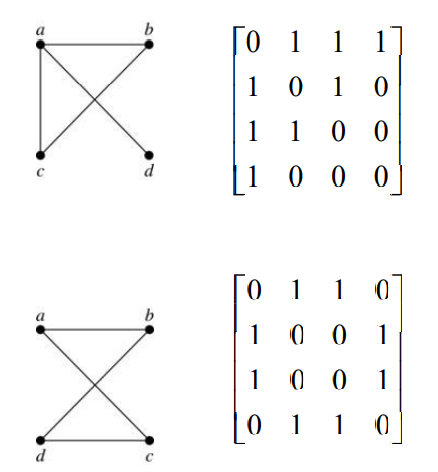
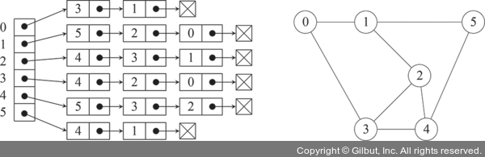
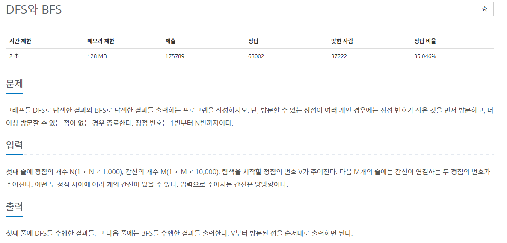

# Algorithm 뿌셔


## 알고리즘 이론

### DFS

DFS란 깊이 우선 탐색이라고도 부르며, 그래프에서 깊은 부분을 우선적으로 탐색하는 알고리즘이다. DFS를 이해하기전에

먼저 그래프라는 자료구조를 알아야 하는데

그래프란 노드와 노드를 연결하는 간선으로 하나로 모아 놓은 자료구조로


이와 같이 표현할 수 있다.

## DFS의 표현방법
인접행렬의 표현:<br>

<br>
  인접행렬의 시간복잡도 와 공간복잡도 장단점<br>

    장점 : 비교적 리스트보다 구현이 간단하고 연결을 확인하는 시간복잡도가 O(1) 이다.
    
    단점 : 노드가 많고 간선이 적을때 비효율적이고 시간복잡도를 O(n^2) 메모리를 차지.
인접리스트의 표현:<br>

<br>
  인접리스트의 시간복잡도 와 공간복잡도 장단점<br>

    장점 : 1. 최악의 경우 시간복잡도가 O(n)이지만 대부분 인접행렬보다 빠르다.
           2. 시간복잡도가 최악을 제외하면 O(E)이므로 인접행렬의 시간복잡도인 O(n^2)보다 효율적이다.
    
    단점 : 맞는 노드를 순회 해야하므로 연결을 확인 하는 시간 복잡도가 O(n)이다.
    
## DFS의 특징
1. 미로를 한 방향으로 갈 수 있을때 까지 탐색하는 것과 비슷함. 막히면 뒤로 돌아와서 다른 방향 탐색하는 것
2. 모든 노드를 방문하고자 할 때 사용
3. DFS가 BFS보다 비교적 간단하다.
4. 대신 BFS보다 느리다.


<br>

## 실제 적용 문제 예시




## 문제 풀이
```py
# DFS

x,y,z = map(int,input().split()) # 입력 받기
graph=[[] for _ in range(y+1)]
visited = [False] * (y+1) # 방문된 정보

for i in range(y): 
    n , m = map(int,input().split())
    graph[n].append(m) # n의 노드와
    graph[m].append(n) # m 의 노드 이어주기
    
for i in range(len(graph)):
    graph[i].sort() # 작은 노드부터 방문하기 위해 정렬


def dfs(z) :
    print(z,end=" ") # 방문 노드 출력
    visited[z] = True # 방문 노드 방문처리
    for i in graph[z]: # z의 노드중 
        if not visited[i]: # 방문하지 않았다면
            dfs(i) # 재귀함수로 방문 // 스택형식
            visited[i] = True # 방문하고 방문처리
dfs(z)
```

사진자료 : https://thebook.io/006952/ch02/02-07/ , https://velog.io/@uchang903/%EC%9D%B4%EC%82%B0%EC%88%98%ED%95%99-%EA%B7%B8%EB%9E%98%ED%94%84-%ED%91%9C%ED%98%84-%EB%B0%A9%EB%B2%95-Representing-Graph-%EC%9D%B8%EC%A0%91-%EB%A6%AC%EC%8A%A4%ED%8A%B8Adjacency-Lists-%EC%9D%B8%EC%A0%91-%ED%96%89%EB%A0%ACAdjacency-Matrices-%EA%B7%BC%EC%A0%91-%ED%96%89%EB%A0%ACIncidence-Matrices
,https://velog.io/@deannn/CS-%EA%B8%B0%EC%B4%88-%EC%9E%90%EB%A3%8C%EA%B5%AC%EC%A1%B0-Graph,https://www.acmicpc.net/problem/1260
