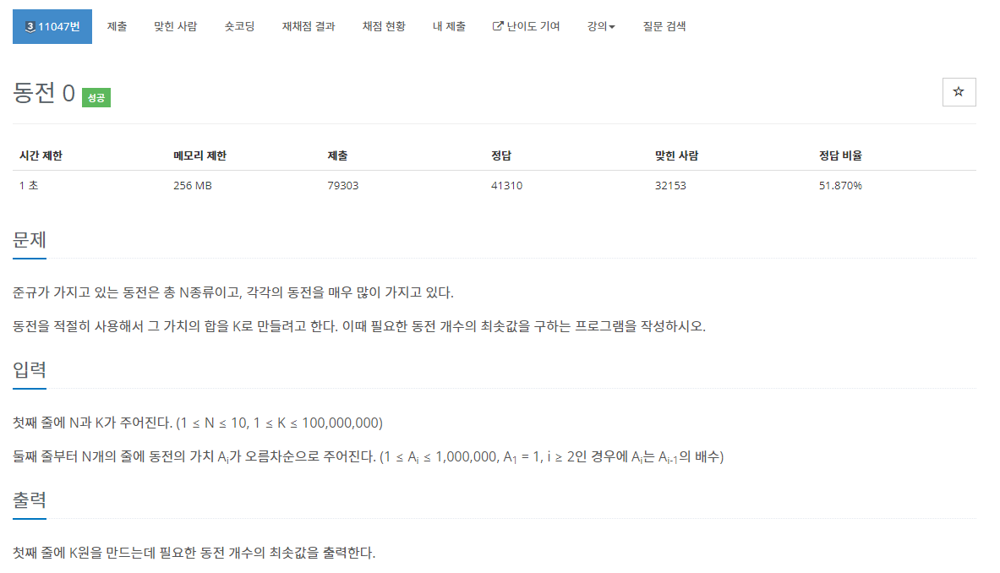

# Algorithm 뿌셔


## 알고리즘 이론


### 그리디 알고리즘
Greedy 라는 말 그대로 탐욕스러운, 욕심 많은 이라는 뜻으로 '현재 상황에서 지금 당장 좋은 것만 고르는 방법'을 의미한다.

탐욕 알고리즘 문제를 해결방법

1. 선택 절차(Selcetion Procdure): 현재 상태에서의 최적의 해답을 선택

2. 적절성 검사(Feasivility Check) : 선택된 해가 문제의 조건을 만족하는지 검사한다.

3. 해답 검사(Solution Check) 원래 문제가 해결되었는지 검사하고, 해결되지 않았다면 선택절차로 돌아가 위의 과정을 반복

그리드 갈고리즘은 100# 최적해를 보장해주지 않는다. 어능정도 적합한 수준의 해답을 알려준다. 근사 알고리즘으로 사용한다.

그리디 알고리즘 예시에는

    1. 거스름돈 문제
    2. 제약조건이 많은 대부분의 문제
    3. 다익스트라 알고리즘
    4. 허프만 코드
    5. 크러스컬 알고리즘
    6. 최소 신장 트리 등이 있다.
참고 자료 : https://hanamon.kr/%EC%95%8C%EA%B3%A0%EB%A6%AC%EC%A6%98-%ED%83%90%EC%9A%95%EC%95%8C%EA%B3%A0%EB%A6%AC%EC%A6%98-greedy-algorithm/,

https://namu.wiki/w/%EA%B7%B8%EB%A6%AC%EB%94%94%20%EC%95%8C%EA%B3%A0%EB%A6%AC%EC%A6%98


## 실제 적용 문제 예시



C언어 코드
```C
#include <stdio.h>

int main(int argc, const char * argv[]) {
    int arr[100],num1,num2,j,i;
    int count = 0,coin = 0;
    scanf("%d %d",&num1,&num2);
    for(i = 0;i<num1;i++)
    {
        scanf("%d",&arr[i]); // 동전들 입력
    }
    for(j = i-1 ;j>=0;j--)
    {
        count = 0;
        if(num2 < arr[j])
            continue; // num2가 나눌수있는 수가 나올수있을때 까지 동전단위 찾기
        else {
            count += (num2/arr[j]); // 맞는 동전을 찾으면 나눈후 count에 더하기
            num2 = num2 - (count*arr[j]); //잔액 구하기
            coin += count; // 동전 갯수만큼 coin 변수에 더해주기
        }
    }
    printf("%d\n",coin);
    return 0;
}
```

파이썬 코드

```py
change = []
count = 0
n , coin = map(int,input().split())
for i in range(n):
    change.append(input()) # 화폐단위 리스트에 추가
change = list(map(int, change)) # 리스트 정수형으로 바꿔주기
change.sort(reverse=True) # 내림차순으로 바꿔서 큰 것 부터 비교하기
for i in change:
    count += coin // i # 동전 갯수를 추가
    coin %= i # 남은돈 갱신
print(count)
```
## 이코테

### 상하좌우
여행가 A는 N × N 크기의 정사각형 공간 위에 서 있다. 이 공간은 1 × 1 크기의 정사각형으로 나누어져 있다.
가장 왼쪽 위 좌표는 (1, 1)이며, 가장 오른쪽 아래 좌표는 (N, N)에 해당한다.
여행가 A는 상, 하, 좌, 우 방향으로 이동할 수 있으며, 시작 좌표는 항상 (1, 1)이다. 우리 앞에는 여행가 A가
이동할 계획이 적힌 계획서가 놓여 있다

계획서에는 하나의 줄에 띄어쓰기를 기준으로 L, R, U, D 중 하나의 문자가 반복적으로 적혀있다.
각 문자의 의미는 다음과 같다

L: 왼쪽으로 한 칸 이동
R: 오른쪽으로 한 칸 이동
U: 위로 한 칸 이동
D: 아래로 한 칸 이동

이때 여행가 A가 N × N 크기의 정사각형 공간을 벗어나는 움직임은 무시된다
예를 들어 (1, 1)의 위치에서 L 혹은 U를 만나면 무시된다
다음은 N = 5인 지도와 계획이다

입력
첫째 줄에 공간의 크기를 나타내는 N이 주어집니다. (1<=N<=100)
둘째 줄에 여행가 A가 이동할 계획서 내용이 주어집니다. (1<=이동 횟수<=100)

출력
첫째 줄에 게임의 룰에 맞게 선택한 카드에 적힌 숫자를 출력

#### 입력 예시
5
R R R U D D

#### 출력 예시
3 4

### 책 솔루션
```py
n = int(input())
x,y = 1, 1
plans = input().split()

# 좌표기준으로 추가 되는값
dx = [0,0,-1,1]
dy = [-1,1,0,0]

# 읽어드릴 리스트
move_types = ['L','R','U','D']


for plan in plans: # 문자 하나를 비교
    for i in range(len(move_types)): 
        if plan == move_types[i]:# move_types안에서의 문자열과 같은거를
            nx = x + dx[i] # 좌표 기준으로 더해준다
            ny = y + dy[i]
    if nx < 1 or ny 1 or nx > n or ny > n: # 범위를 넘어가는것들은 예외 처리
        continue 
    x , y = nx, ny 
    
print(x,y) # 출력

```

기존의 행렬(Matrix)과 같은 풀이를 생각하여 비슷한 풀이법을 생각했지만 x와 y좌표를 따로 더하는 부분에서 오류가 나아 제 시간에 풀지못했다

책에서는 nx와 ,ny로 따로 변수를 만들어서 대입하는 것을 보고 대단하다고 생각했당.....
